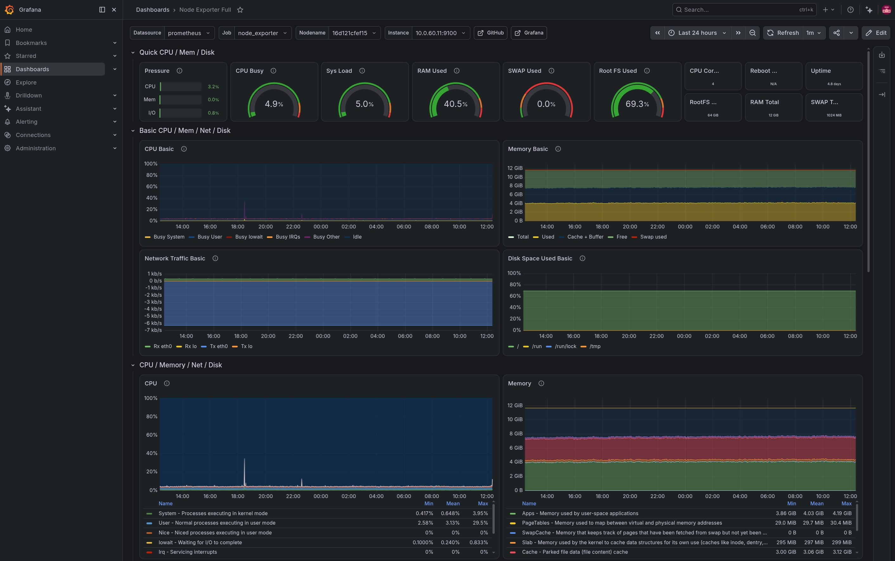

# Monitoring Stack with Prometheus and Grafana


## Overview



This project demonstrates the deployment of a monitoring and observability stack using Prometheus and Grafana within my Docker-based homelab environment.

The objective of the project was to gain practical experience collecting, storing and visualising infrastructure metrics while building a monitoring platform similar to those used in production environments.

Prometheus is responsible for collecting and storing metrics, while Grafana provides dashboards for visualising the health and performance of servers, containers and services.

A detailed walkthrough of this project is available on my blog:

https://homelab.sanjuprojects.uk/grafana-and-prometheus/

---

## Project Objectives

The objectives of this project were to:

- Deploy Prometheus using Docker Compose
- Deploy Grafana for metric visualisation
- Monitor Linux hosts using Node Exporter
- Monitor Docker containers using cAdvisor
- Build dashboards to visualise infrastructure health
- Gain practical experience with monitoring and observability

---

## Technologies Used

- Docker
- Docker Compose
- Prometheus
- Grafana
- Node Exporter
- cAdvisor
- Linux
- YAML

---

## Architecture

```
                    Linux Hosts
                         │
                  Node Exporter
                         │
                         │
Docker Containers ── cAdvisor
                         │
                         ▼
                   Prometheus
                  (Metric Storage)
                         │
                         ▼
                     Grafana
                 (Dashboards)
```

---

## Repository Structure

```
monitoring-stack/
│
├── README.md
│
├── grafana/
│   └── docker-compose.yml
│
├── prometheus/
│   ├── docker-compose.yml
│   └── config/
│       └── prometheus.yml
│
├── docs/
└── images/
```

Persistent data directories such as `grafana-storage` and `prometheus_data` are excluded from version control because they are generated during deployment.

---

## Prometheus

Prometheus is responsible for scraping metrics from configured targets and storing them as time-series data.

The configuration defines the monitoring targets, scrape intervals and exporters used within the homelab.

Metrics collected include:

- CPU usage
- Memory utilisation
- Disk usage
- Network activity
- Docker container statistics

---

## Grafana

Grafana connects to Prometheus as a data source and provides dashboards for visualising collected metrics.

The deployment includes plugin support and is exposed securely through Traefik using HTTPS.

---

## Deployment

Clone the repository:

```bash
git clone https://github.com/sanju-mathew/monitoring-stack.git
cd monitoring-stack
```

Deploy Prometheus:

```bash
cd prometheus
docker compose up -d
```

Deploy Grafana:

```bash
cd ../grafana
docker compose up -d
```

After deployment, configure Prometheus as a Grafana data source and import your preferred dashboards.

---

## Validation

After deployment I verified:

- Prometheus successfully scraped configured targets
- Node Exporter metrics were collected
- cAdvisor container metrics were available
- Grafana connected successfully to Prometheus
- Dashboards displayed real-time infrastructure metrics
- Services were accessible through Traefik

---

## Security Considerations

The deployment incorporates several security practices:

- HTTPS provided by Traefik
- Docker services isolated using an external Docker network
- Persistent data stored outside containers
- Monitoring services accessible through the reverse proxy
- Infrastructure configuration maintained using version-controlled Docker Compose files

---

## Engineering Outcomes

This project strengthened my practical understanding of:

- Infrastructure monitoring
- Time-series databases
- Metric collection
- Dashboard creation
- Docker networking
- Service observability
- Troubleshooting distributed services

It also reinforced the importance of proactive monitoring for maintaining reliable infrastructure.

---

## Potential Enhancements

Possible future improvements include:

- Add Alertmanager for alert routing
- Integrate Loki for centralised log collection
- Add Promtail log shipping
- Deploy Grafana provisioning for automated dashboard configuration
- Monitor Kubernetes workloads
- Integrate notification channels such as Slack or Microsoft Teams

---

## Skills Demonstrated

- Docker Compose
- Linux Administration
- Prometheus
- Grafana
- Node Exporter
- cAdvisor
- Monitoring and Observability
- YAML
- Infrastructure Documentation